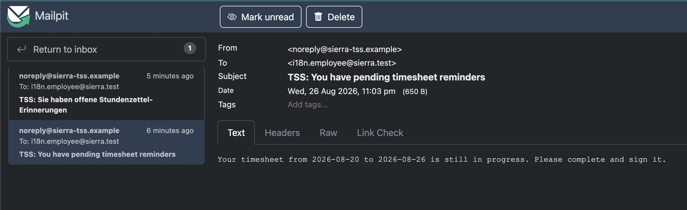
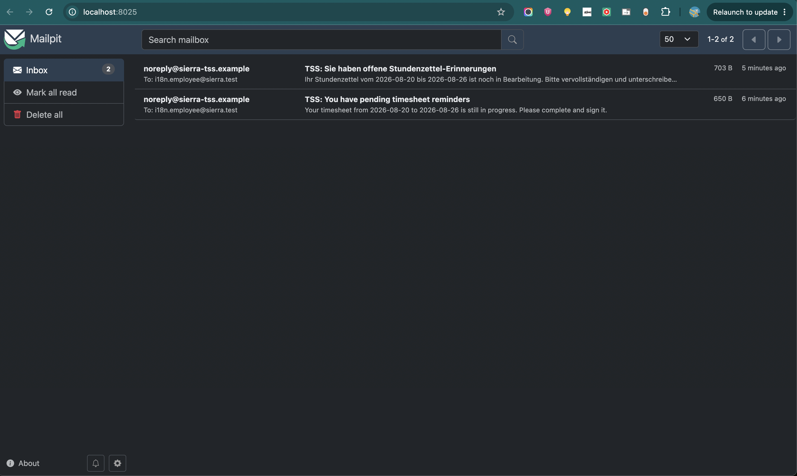

# Internationalization

- Supported languages are English (`en`) and German (`de`).
- Persist ISO language codes, not display names such as `English` or `Deutsch`.
- `Person.preferred_language` is required and defaults to `en`.
- New users and anonymous pages use English by default.
- Missing or invalid legacy preferences fall back to English when read.
- Keep `SupportedLanguage` limited to enum values.
- Keep code validation and `Locale` conversion in `LanguageResolver`.
- Reuse `LanguageResolver`; do not duplicate language mappings in beans or services.
- `LocaleBean` loads the authenticated user's preference once per HTTP session.
- Changing the UI language also persists the authenticated user's preference.
- `CurrentPersonBean` prevents secured person lookups on public pages.
- `PersonService` derives the user from the GlassFish principal; callers do not provide a person ID when changing a preference.
- Reminder subjects and bodies use the recipient's persisted language.
- English reminder messages are stored in `sierra/tms/i18n/reminder_messages.properties`.
- German reminder messages are stored in `sierra/tms/i18n/reminder_messages_de.properties`.
- All reminder bundles must contain the same keys and compatible `MessageFormat` placeholders.
- RE5 aggregation remains unchanged: each normalized email address receives at most one collected reminder email per run.

## E2E Test

1. Prepare a due reminder using this guide &gt; [Reminder Service E2E Test Guide](reminder-service-e2e-test-guide.md).
2. Set the recipient's `preferred_language` to `en`, trigger the reminder, and verify an English subject and body in Mailpit.

   

3. Set the preference to `de`, redeploy if the value was changed directly with SQL, and verify a German subject and body.
4. Confirm that both emails have the correct recipient and timesheet dates and that only one email is produced per run.

   
