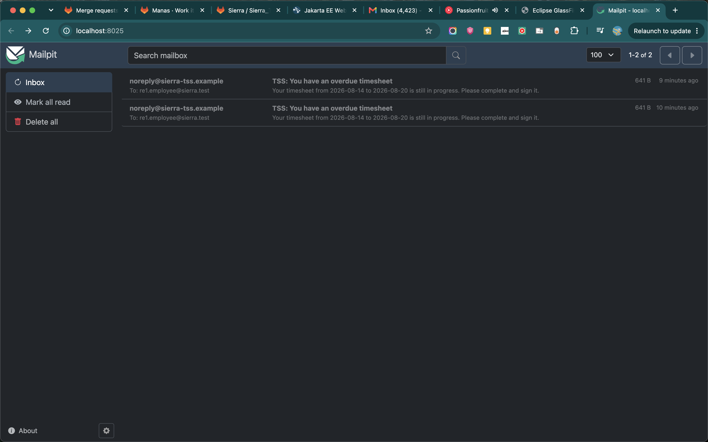

# Reminder Service E2E Test

This guide verifies the employee, reviewer, and secretary reminder flows and the daily email aggregation requirements.

The application normally checks once a day at 07:00 in the `Europe/Berlin` time zone. During this test only, the schedule is changed to run once per minute so that the result is visible immediately.

### Do not commit the temporary one-minute schedule.

## Prerequisites

- MySQL is running and the `sierra` database exists.
- GlassFish server.
- The database should contain `supervisor@sierra.test`.

## 1. Start a local email inbox

Install Mailpit once:

```shell
brew install mailpit
```

Start it:

```shell
mailpit
```

Mailpit receives SMTP mail on port `1025`.

Its web inbox is available at <http://localhost:8025>.

## 2. Configure GlassFish mail once

If `mail/tssMailSession` does not already exist, run:

```shell
$GLASSFISH_HOME/bin/asadmin create-mail-resource \
  --mailhost localhost \
  --mailuser sierra \
  --fromaddress noreply@sierra-tss.example \
  --property mail.smtp.port=1025 \
  mail/tssMailSession
```

Confirm that it exists:

```shell
$GLASSFISH_HOME/bin/asadmin list-mail-resources
```

Expected output includes:

```text
mail/tssMailSession
```

## 3. Temporarily run the reminder every minute

Open:

```text
Sierra_2026_TimeSheetManagementSystem/Sierra_2026-ejb/src/java/
sierra/tms/services/impl/ReminderServiceImpl.java
```

Temporarily change the `@Schedule` values to:

 

```java
@Schedule(
        hour = "*",
        minute = "*",
        second = "0",
        timezone = TIME_ZONE_ID,
        persistent = false)
```

 



## 4. Add an isolated test timesheet

1. Open MySQL
2. Paste the following SQL. It first removes an unfinished fixture from an older test run, then creates one employee, contract, and timesheet ending today.

```sql
DELETE t
FROM Timesheet t
JOIN Contract c ON c.id = t.contract_id
WHERE c.name = 'RE1 E2E TEST';

DELETE FROM Contract WHERE name = 'RE1 E2E TEST';
DELETE FROM Person WHERE email_address = 're1.employee@sierra.test';

SET @supervisor_id = (
    SELECT id
    FROM Person
    WHERE email_address = 'supervisor@sierra.test'
);

INSERT INTO Person (
    consent,
    email_address,
    first_name,
    last_name,
    preferred_language,
    university_staff
) VALUES (
    1,
    're1.employee@sierra.test',
    'RE1',
    'Employee',
    'en',
    0
);

SET @employee_id = LAST_INSERT_ID();

INSERT INTO Contract (
    archive_duration,
    end_date,
    frequency,
    hours_per_week,
    name,
    start_date,
    status,
    vacation_days_per_year,
    working_days_per_week,
    employee_id,
    supervisor_id
) VALUES (
    24,
    DATE_ADD(CURDATE(), INTERVAL 1 YEAR),
    'WEEKLY',
    40,
    'RE1 E2E TEST',
    CURDATE(),
    'STARTED',
    20,
    5,
    @employee_id,
    @supervisor_id
);

SET @contract_id = LAST_INSERT_ID();

INSERT INTO Timesheet (
    end_date,
    start_date,
    STATUS,
    contract_id
) VALUES (
    CURDATE(),
    DATE_SUB(CURDATE(), INTERVAL 6 DAY),
    'IN_PROGRESS',
    @contract_id
);

SELECT t.ID, t.start_date, t.end_date, t.STATUS, p.email_address
FROM Timesheet t
JOIN Contract c ON c.id = t.contract_id
JOIN Person p ON p.id = c.employee_id
WHERE c.name = 'RE1 E2E TEST';
```

3. Exit MySQL

## 5. Build and deploy

## 6. Verify the email

Check all of the following:

- Recipient: `re1.employee@sierra.test`
- Subject: `TSS: You have pending timesheet reminders`
- Body contains the test timesheet's start and end dates.
- Body asks the employee to complete and sign the timesheet.

## RE1-RE5 test results

| Requirement | Test fixture | Expected result |
| --- | --- | --- |
| RE1 | `IN_PROGRESS`, ending today | Employee receives a completion reminder |
| RE2 | `SIGNED_BY_EMPLOYEE` | Supervisor and both assistants receive a review reminder |
| RE3 | `SIGNED_BY_SUPERVISOR` | Both secretaries receive a processing reminder |
| RE4 | States remain unchanged for a second run | Every reminder is sent again |
| RE5 | One address is both an assistant and secretary | One email contains both distinct reminders |

The first run produced one email for each applicable address. 

The shared recipient received one email containing the RE2 and RE3 messages. 

The second run produced one new email per address, confirming daily repetition.

## 7. Restore the real schedule

Change `ReminderServiceImpl.java` back to:

```java
@Schedule(
        hour = "7",
        minute = "0",
        second = "0",
        timezone = TIME_ZONE_ID,
        persistent = false)
```

 

Ensure that the temporary schedule does not appear in `git diff`.

## 8. Remove the test data

## 9. Stop Mailpit

Return to the Mailpit terminal and press `Ctrl+C`.
